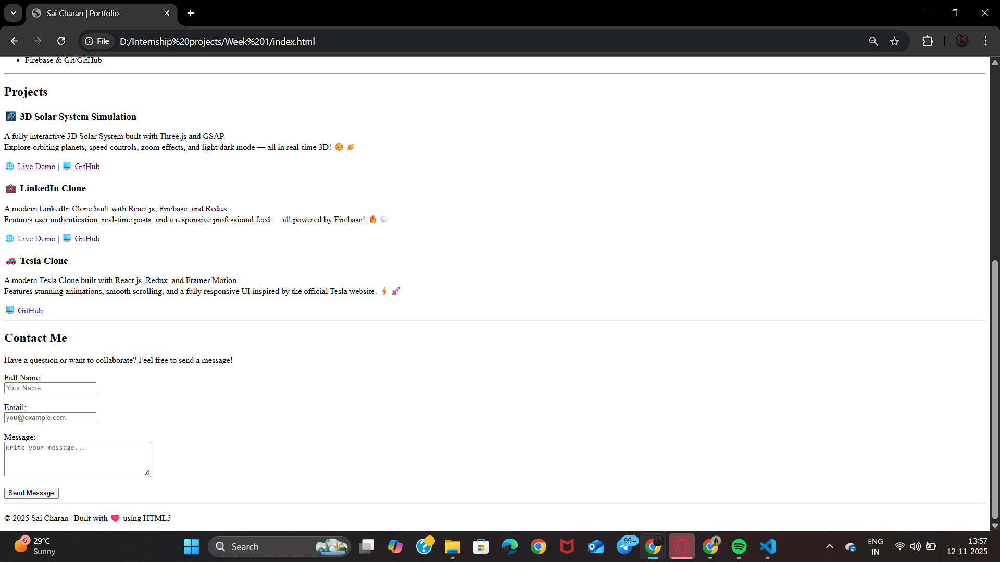

<h1 align="center">🌐 Personal Portfolio (Week 1 Project)</h1>

<p align="center">
  
  
  
</p>

<p align="center">
  A simple and clean <b>Personal Portfolio Website</b> built using <b>HTML5</b> as part of my Week 1 Internship Project.  
  It includes my <b>introduction, skills, projects, and a contact form</b>. ✨
</p>

---

## 🎯 Features

- 📄 Semantic and structured HTML5 layout  
- 🙋 About Me section introducing myself and my career goals  
- 💡 Skills section (HTML, CSS, JavaScript, React.js, Firebase)  
- 💼 Projects section for future showcases  
- ✉️ Contact form with name, email, and message fields  
- 🌈 Beginner-friendly and responsive foundation  

---

## 🛠️ Technologies Used

- **HTML5**

---

## 📸 Preview

  
  
---

## 🚀 How to View

To view the project locally:  
```bash
open index.html
```
---

## 👨‍💻 Author

It’s me — **Sai Charan Janagama** 😄<br>
🎓 Computer Science Graduate | 🌐 Aspiring Full Stack Developer<br>
📧 [Email Me](saic89738@gmail.com) ↗<br>
🔗 [LinkedIn](https://www.linkedin.com/in/saicharanjanagama/) ↗<br>
💻 [GitHub](https://github.com/SaiCharanJanagama) ↗

---

## 💬 Feedback

If you have any feedback or suggestions, feel free to reach out!  
Your input helps me improve 🚀
